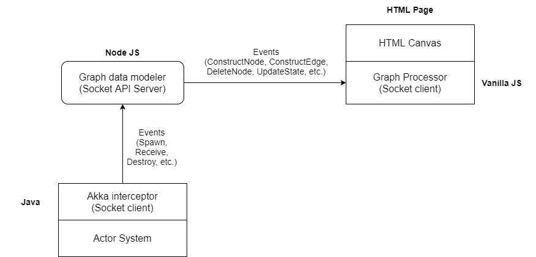

# Akka Client-Server Visualizer (by Siddhanth Venkateshwaran)
The visualizer is a client-server system built using Node JS, Java and Vanilla JS which intercepts the creation/destruction of actor entities and messages transferred among those entities and constructs a self-updating graph network on a plain HTML canvas. The graph network has one node corresponding to each actor entity that currently exists in the akka program and an edge corresponding to each message that is transferred among relevant entities. One of the important goals of this prototype is to facilitate visualization of dynamically changing *states* while being consistent with the actual program execution and thus helping the programmer get a better intuitive sense of how his/her program behaves under normal conditions.

## Design

The visualizer has the following components:

- Akka Interceptor
- API Server / Data modeler
- Graph processor

### Akka interceptor
The **akka interceptor** is a java program that captures the following events occurring inside of an actor system - Actor Spawn, Actor Termination, Receipt of messages and update of actor states. Currently, the interceptor defines a common interface for all messages that should be visualized, and requires every message to include a key within itself and implement the following method to return that key:
```
interface Message {
	long getSenderKey();
}
```
When an actor entity is *spawned*, it is submitted to the visualizer instance, which creates and returns a unique key for that actor entity and stores it in a lookup table. Specifically, this key is for helping the visualizer determine who the sender of a particular message is, considering the fact that akka messages may or may not have the identity of the sender at all times.  Owning to this and the fact that every akka message implements the above method, the interceptor can simply access the key from  the message and use a lookup table (keys to actor names) to find the corresponding actor entity that sent this message.

The interceptor also defines a special construct to let the program notify the interceptor of a message receipt event, which is given as follows:
```
MessageWrapper {
	message: Message,
	receiver: String,
	timestamp: long	
}
```
- **message**: This is any message which implements the above *Message* interface. The interceptor uses the **reflection api** to get the runtime class name of this message that the graph processor uses to label edges in the graph network. Most importantly, this message can be used to access the unique key of the actor entity who sent this specific message (as per the above explanation).
- **receiver**: This is the unique path name of the actor entity that has just notified the interceptor of a message receipt event, and is used by the graph processor to find the receiver node using a unique node ID that the server defines (explained below).
- **timestamp**: To ensure that akka events get visualized in the order that they actually occur in the original program, the interceptor uses a millisecond-timestamp obtained using the method ``new Date().getTime()``, which returns the number of milliseconds passed since ``January 1, 1970 00:00:00 GMT``, and places this value in the outgoing socket event. This timestamp is used by the node js server to reorder events in non-decreasing order of this timestamp value before letting the graph processor know of any of these events. This timestamp value is inserted in all of the intercepted events mentioned above i.e. *actor spawn*, *message receipt*, *state update* and *actor termination*. It is **important** to note, however, that 2 subsequent events can have the same timestamp values if they occur within a fraction of a millisecond.  But, considering the fact that this interception occurs locally to the akka program by way of local method calls, the event that occurred first indeed makes the method call first and thus it is guaranteed that this event will be inserted in the server's event queue (explained below) **before** the subsequent event (which may have the same timestamp value).

The state changes of each actor entity are (voluntarily) captured by the interceptor i.e. the akka program has to explicitly construct a map of strings to objects, and send this map to the interceptor. The main reason for this implementation methodology is that the akka framework disallows external programs from directly accessing the internal state of an actor entity, and the only way of getting access to it is if the actor entity itself shares this state using one of its messages.

The data in the outgoing socket events are serialized using the [Jackson object mapper](https://www.baeldung.com/jackson-object-mapper-tutorial).

### Api Server and Data Modeler
The socket events emitted from the actor-system interceptor are received by a **Node JS** server instance, which defines a different socket api endpoint for every other event, and manages the data relevant to nodes and edges. More specifically, it defines the following models for storing nodes and edges:
```
Node {
	id: Number,
	label: String,
	state: Object
}
``` 
```
Edge {
	id: Number,
	from: Number,
	to: Number,
	label: String,
	count: Number,
    weight: Number
}
```
- **Node**: Every node that is to be constructed in the graph is assigned a unique identifier by the server and this ID is used to update the state of that specific node in the graph. The server also maintains (forward and inverted) lookup tables from node names to IDs and nodeIDs to corresponding node objects, as the interceptor only specifies the actor names in the socket events. The IDs remain consistent between the server and graph processor component while updating the graph dataset. The state of each node is maintained as a generic object structure, which is defined as per the state map which is sent by the akka program, as explained above. This ensures that no changes need to be done in the data structure if the actor entity suddently obtained additional or lost existing properties, as long as the akka program sends out the correct map of state values.

- **Edge**: Similar to the node structure, the server assigns a unique ID to each edge that gets constructed in the graph and uses that ID to manipulate properties of that specific edge, for example, to find which connections in the actor system have the largest number of messages being passed, by maintaining a counter. Each edge stores the IDs of the sender and receiver nodes of the corresponding message, respectively in the "from" and "to" properties of the above structure.

The server maintains a **priority-queue** of events that are sent by the interceptor, ordered in non-decreasing order of event timestamps, and based on the frequency of graph processing updates which is specified by the user (explained below) pops the earliest event in the queue and sends it to the graph processor to be processed.

### Graph processor
The graph processor utilizes the [vis.js](https://visjs.org/) graph visualization library to construct and manage a graph network and make frequent updates as directed by the server. Specifically, it receives events from the server in order of timestamps, and based on those events, does one of the following:

- Construct a new node in the graph with specific properties
- Construct a new edge between two existing nodes in the graph with specific properties
- Delete an existing node in the graph

Apart from these, it currently provides a number of other features which can be used to manipulate the visualization as per the user's needs, some of which are the following:

- **Cluster**: Cluster nodes belonging to a specific group, based on some property of the nodes. This is useful when the program creates a large number of actors that can fill up the whole graph network and make it difficult to examine each individual nodes and their states as they change. If the user has a particular group of actors of interest, then he/she can specify the property name and a corresponding color for the node which represents the whole group in the relevant text boxes and use the corresponding *Add group* button to add that group for the cluster operation. When one of the *Cluster* buttons is clicked the visualizer will immediately group all nodes having the same values for the specified group and represent all of them using a single node.

- **Show clogged connections**: As explained in the above section, the server maintains a counter for each edge, indicating the number of times an edge was constructed between the corresponding nodes, and thus giving the total number of messages which was passed between the corresponding actors. The server also maintains a weight for each edge that is directly proportional to the counter value. The graph processor uses these properties of an edge to conditionally enlarge the edge display to represent the clogged nature of the connection. This option can be turned on/off using the buttons *Show clogged connections* and *Show default connections* respectively.

- **Pause/Resume**: As the server maintains a priority-queue of events, the graph processor is able to direct the server to change the rate at which events are dequeued and thus allow the user to view the graph network update itself at different speeds, or pause all updates if so desired. When the event updates are to be resumed, the following details need to be mentioned in the relevant text boxes:
  1. Number of event updates per unit time (this time value is entered next)
  2.  The amount of time (in seconds) that defines the rate of the event updates.
      For example - 3 events and 1 second will lead to the server dequeuing events once every 0.3 seconds and thus leading to a total of 3 events getting processed in 1 second, and, 5 events and 2 seconds will lead to the server dequeuing events once every ~0.4 seconds, leading to a total of ~5 events getting processed in 2 seconds.

  It is **important**, however, that if the event updates are paused indefinitely then the socket event queue in the server can start growing in size quickly as more and more events are pushed by the interceptor client. To prevent this, the queue structure will need to be more complex and separate layers of front and back queues have to be added in a cluster of socket servers arranged in a master-slave manner, where every queue has a unique ID, and the front queues comprise the events that need to processed first and the back queues comprise the events that have to be loaded in one of the front queues when it becomes empty. A heap can be used to store the ID of the front queue having the event which is to be processed next.

### Handling clustered actor systems
The current prototype only works for actor systems that execute in a single node. However in more realistic scenarios where an application can execute in a cluster of actor systems the components of the above system will need to be modified in the following manner:

- Currently, if two different interceptors (corresponding to two different actor system instances) try to connect to the single Node JS server instance, then those will be treated as separate socket clients and thus visualization from both will be interleaved in the same graph network in an undesired manner. To handle interactions between those two actor systems and identify communicating actor entities, it is important to resolve the unique keys and properly map them to actors from different machines, using the entityId of the actors in a similar manner as explained [here](https://doc.akka.io/docs/akka/current/typed/cluster-sharding.html). The message interface structure mentioned above has to be modified to include information about the machine in which each actor entity executes, which can help resolve the actor names when keys from different machines will collide. For this another interceptor layer has to be included between the akka interceptor(s) and the socket server to resolve the keys first before emitting events to the server.
-  As for the server itself, considering actor keys from different machines to be resolved at the interceptor layer, minimal to no changes need to be made at both the server and the graph processor components to handle clustered actor systems.


## Example actor programs
The project currently has 2 example actor programs that can be run to examine the visualization:

- One is a custom implemented program comprising 1 actor and 1 guardian, where the guardian schedules messages to itself, and depending on a randomly generated guess, either spawns additional instances of the other actor, or pings a specific actor instance to make it send a message to another actor instance. Below is a snippet of the visualization for one run of this example:
  


- The 2nd example is a modified implementation of a chat-room application that is taken from akka's website, given [here](https://doc.akka.io/docs/akka/current/typed/actors.html#a-more-complex-example).
  This application consists of an actor representing a chatroom, and another actor representing a client, which can join the chatroom and post messages, which get published to all connected clients. Every client is connected to a correponding session actor which it gets access to when initially connecting to the chatroom. The website implementation originally consisted of a client sending a request to join the chatroom, then posting one message and then terminating. To prolong this execution the implementation has been modified to create multiple clients (using a configurable parameter from the `src/main/resources/input.conf` file), and each client schedules a message to itself in order to post a random message in the chatroom which gets published for all connected clients. The following shows a snippet of the visualization of 2 connected clients, 2 session actors, a chatroom and the user guardian:

.


## Running the programs
- The repository has 2 internal git repositories. Their contents need to be fetched first.

- Initialize them and fetch their contents using both the following commands:
  1. `git submodule init`
  2. `git submodule update`

- The project has 2 main folders, one for the actor programs and the interceptor implementation, and another one for the socker server and graph processor.

- To run the programs, begin by accessing the `vis-network-visualization/server` directory, and run `npm install`. This will install all required dependencies for the node.js server.

- Then start the server using: `node app.js`. This should start the server instance on localhost, port 3001 and print the listening statement. Now the server is listening for socket connections.

- Then from the directory one level up i.e. `vis-network-visualization` start a python server using one of the following commands:
  1. python -m http.server 8001 (for a Windows OS)
  2. python3 -m http.server 8001 (for an Ubuntu OS)
     Now open the browser and access url `http://localhost:8001/`. The html page should display the blank canvas and the relevant buttons and text boxes below the canvas.

- Then switch to the `actor-client-java-scala` directory, and run one of the following commands depending on the choice of example actor system to be visualized:
  1. sbt runMain com.test.Main (for the custom implemented example)
  2. sbt runMain com.chat.Main (for the chatroom application)

Assuming everything runs correctly, the blank canvas should start updating itself with graph nodes and edges between nodes. **Click** on a particular node to see its state (if it exists) in an alert box and on an edge to see the number of messages passed via that edge. The relevant options below the canvas can be used to manipulate the visualization. For example, to pause the visualization, click the pause button and then enter 1 in both adjacent text boxes (for the number of events and event interval) to get 1 event update per second, and then click resume. To see clogged connections and enlarged edges (corresponding to number of messages passed via that edge) the button labelled *Show clogged connections* can be clicked and reset by clicking the adjacent button labelled *Show default connections*.

## Testing the interceptor
- There are 3 tests defined in the test folder of the actor-client-java-scala directory, in the `com.vis.Main.java` file.

- The 1st test ensures that the keys obtained for two different actor entities submitted to the interceptor are different and unique. The 2nd test examines the monotonically increasing nature of the timestamps of two subsequent message receipt events notified by a given actor entity. As explained in the above section, two subsequent events can have the same timestamps but should be in non-decreasing order. The 3rd test submits three actor entities, then kills two of them and then ensures that they were removed from the lookup table of the interceptor and that no keys exist for them henceforth.

- To run the test file, access the `actor-client-java-scala` directory and run any one of the following commands:
  1. `sbt testOnly com.vis.Main`
  2. `sbt test`